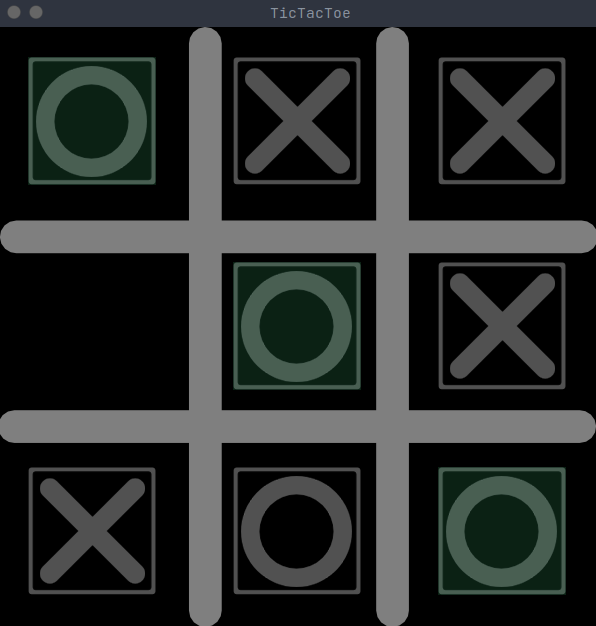

# SFML_TicTacToe_Socket

<!-- ABOUT THE PROJECT -->
## About The Project
I want to make my chess game to a socket one so i first made a socket TicTacToe
to practice using msgpack and sockets with sfml

### Built With

c++

<!-- GETTING STARTED -->
## Getting Started
g++ -o main.cpp main.cpp -o sfml-game -lsfml-graphics -lsfml-window -lsfml-system -pthread

### Usage
   ./filename -[x,o]
   Note:
    it will ask one to be server and other to be client,
    it can be easily changed if you want it to i keep it like that.
    
### Example

### Prerequisites

c++ compiler
sfml library
msgpack c++ edition
boost 

## License

Distributed under the MIT License. See `LICENSE` for more information.

